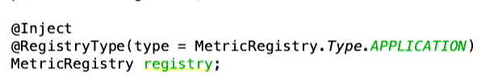
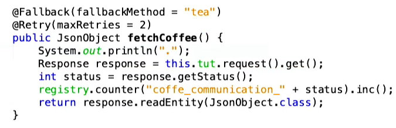
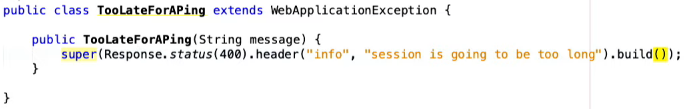

# 02-microservices-individual-tasks-stefanleithenmayr

## Adam Bien Video (https://www.youtube.com/watch?v=qWdoLnaQ8vY&feature=youtu.be)

### JakartaEE 8 + Microprofile 3.0 (Adam Bien)

Watch and Deploy (von Adam Bien)
(Schaut auf Veränderungen und falls sich der Source Code verändert wird neu gebuildet und auf 4 Server deployed (Wildfly, Open Liberty, Apache Tommy and Payara) 

#### Inhalt: Convention over Configuration
Übereinkommen bzw. Standards über ständige Konfiguration
Conventions sparen Zeit 
Keine Doku erforderlich
FileIT (IT = Integration Test ist eine Maven Convention)

Time to first commit – Zeit bis Hello World angezeigt werden kann
JSONP vs. JSONB

EJB (Enterpise Java Beans)
Komponenten die Funktionalität und Daten kapseln
Nicht-geschäftsspezfisiche Aufgaben werden vom Container übernommen!
`@Stateless`

CDI (Contexts and Dependency Injection)
Ermöglichkeit die Injektion von Abhängigkeiten

Inhalt des Videos (Projektbezug)
* Kleiner Mikroservice wurde erstellt (Caffee produzieren)
* Integration Tests dafür wurde erstellt
* Weiter kleiner Mikroservice wurde erstellt (Stardukes um auf das Kaffee produzieren zuzugreifen)
* Beide Mikroservices liefern kleine war (Webarchive Files), welche miteinander kommunizieren können


Microprofile Metrics zeigt an wie oft ein Request durchgeführt wurde, bzw. kann man sich den HTTP Code mitanzeigen lassen

`@Retry` wie oft soll der Request wiederholt werden<br>
`@Fallback`: Alternative Methode die ausgeführt wird falls der Request nicht durchgeführt werden kann<br>
`@Timed` über Business Methoden zeigt die Zeit an wie lange eine Methode benötigt hat<br>



Eine Softwaremetrik, oder kurz Metrik, ist eine (meist mathematische) Funktion, die eine Eigenschaft von Software in einen Zahlenwert, auch Maßzahl genannt, abbildet. Hierdurch werden formale Vergleichs- und Bewertungsmöglichkeiten geschaffen

Prometheus: https://www.heise.de/developer/artikel/Prometheus-Monitoring-fuer-Java-Entwickler-3589523.html?seite=all

OpenMetrics (kommt bald)<br>
Auswertung von Metriken<br>
Vergleichbar mit OpenAPI (Swagger)<br>

ExceptionHandling



Microprofile Metrics 
https://quarkus.io/guides/metrics-guide
## Wichtige Befehle
Befehl zum Starten der gedockerten Postgres Datenbank: 	`docker run --name cardealer-postgres -p 5432:5432 -e POSTGRES_PASSWORD=passme -d postgres` <br/>
Befehl zum Starten von Quarkus: `mvn compile quarkus:dev` <br/>
Alternativ kann auch über die Maven Lifecycles kompiliert werden (siehe Tutorial von Herr Professor Stütz)

## Erklärung
Insgesamt sind in diesem Repository zwei Quarkus - Projekte, wobei der zewite Service auf den ersten zugreift. Man kann sich das ganze in meinem Beispiel als Autohaus und Kunde der auf der Website schaut, welche Autos zu kaufen sind, vorstellen.

Das erste Quarkus Projekt läuft auf dem Port 8080, und das zweite auf 8082, weil es sonst zu Überschneidungen kommt.


## Metrics 

``` 
    @Counted(name = "requestAmount", description = "Amount of Requests")
    @Timed(name = "responseTimer", description = "Response Time", unit = MetricUnits.MILLISECONDS)
    @Retry(maxRetries = 2) 
```
  
* REST - Url: `http://localhost:8082/metrics/application`
